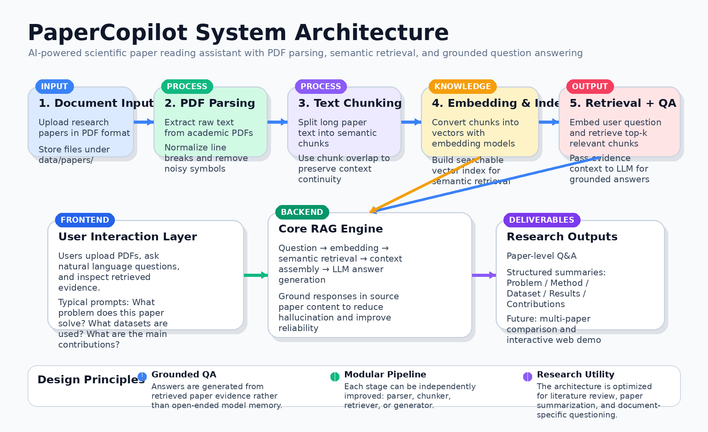

# 📚 PaperCopilot
### An AI-Powered Scientific Paper Reading & Question Answering Assistant



<p align="center">


</p>

---

# 📖 Overview

**PaperCopilot** is an AI-powered assistant designed to help researchers **read, analyze, and interact with scientific papers more efficiently**.

The system processes academic papers in **PDF format**, extracts and segments the text, and enables **semantic search and question answering** over the content.

By combining **document parsing, vector embeddings, and retrieval-augmented generation (RAG)**, the system allows users to ask questions about a paper and receive answers grounded in the document itself.

This project aims to build a **lightweight research assistant** for faster literature review and knowledge extraction.

---

# 🎯 Project Goal

The goal of this project is to build an intelligent system that can:

- Automatically **parse academic papers**
- Convert document content into **semantic representations**
- Enable **context-aware question answering**
- Assist researchers in **quickly understanding research papers**

Instead of manually scanning long papers, users can interact with the document through natural language queries.

Example questions:

```text
What problem does this paper solve?
What dataset is used in the experiments?
What are the main contributions of the paper?
How does this method compare with previous work?
```

---

# ✨ Key Features

### 📄 PDF Paper Parsing
Extract raw text from scientific papers in PDF format.

### 🧩 Document Chunking
Split long documents into manageable text segments for efficient processing.

### 🔎 Semantic Retrieval
Convert text into embeddings and retrieve the most relevant content based on a query.

### 💬 Paper Question Answering
Answer user questions using retrieved document context.

### 🧠 Research Assistance
Help users quickly identify:

- Research problems
- Methods
- Experimental results
- Key contributions

---

# 🏗 Project Structure

```text
paper-copilot
│
├── README.md
├── requirements.txt
│
├── src/
│   ├── pdf_parser.py      # Extract text from PDF papers
│   ├── chunker.py         # Split text into semantic chunks
│   ├── retriever.py       # Retrieve relevant chunks via embeddings
│
├── data/
│   └── papers/            # Storage for input research papers
│
└── docs/
    └── system_architecture.png
```

---

# ⚙️ Technology Stack

### Programming Language

- **Python 3.10+**

### Core Technologies

- **Natural Language Processing (NLP)**
- **Vector Embeddings**
- **Retrieval-Augmented Generation (RAG)**

### Libraries (planned)

- `PyTorch`
- `NumPy`
- `sentence-transformers`
- `pdf parsing libraries`

---

# 🧠 System Workflow

The core workflow of the system is:

```text
PDF Paper
   ↓
Text Extraction
   ↓
Text Chunking
   ↓
Embedding Generation
   ↓
Semantic Retrieval
   ↓
LLM-based Question Answering
```

This design allows the system to provide **answers grounded in the document content**, reducing hallucination and improving reliability.

---

# 🚀 Future Work

Planned improvements include:

- Multi-paper knowledge base
- Structured paper summarization
- Experimental result extraction
- Interactive web interface
- Visualization of retrieved context

---

# 📌 Project Status

This project is currently in the **early development stage**.

Upcoming milestones:

- [ ] Implement PDF parser
- [ ] Implement text chunking
- [ ] Implement semantic retrieval
- [ ] Integrate question answering
- [ ] Build simple user interface

---

# 🤝 Contribution

This project is currently under active development.  
Contributions, suggestions, and discussions are welcome.

---

# 📜 License

MIT License
